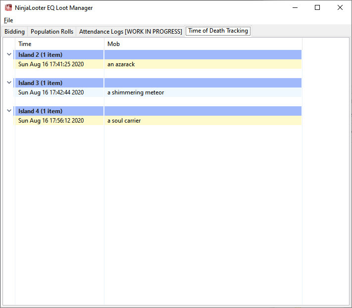

NinjaLooter Raid Manager for EQ
===============================

Designed to handle looting for Plane of Sky with the Federation,
but should work in many other cases.

Copy `ninjalooter.ini.example` to `ninjalooter.ini` and configure
your log path, run `pip install -e .`, and you should be good to go!

It will handle:

Bidding
-------

Attendance Management
---------------------

Population Rolls
----------------

Time of Death Tracking
----------------------

Testing
=======

Install `tox`

Run: `tox -e [pep8,pylint,coverage]`

Building
========

Install `pyinstaller`

Run: `pyinstaller --onefile ninjalooter_py.spec`